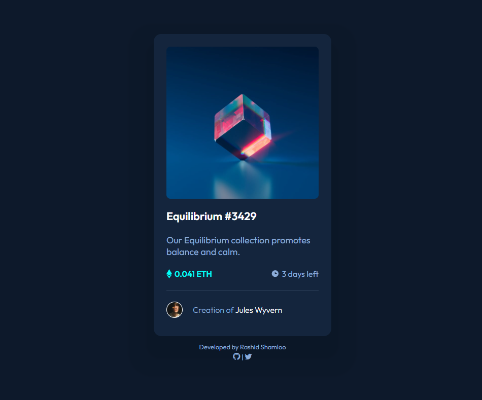

# Front End Mentor - Project 003 - NFT Preview Card Component

This is a solution to the [NFT Preview Card Component challenge on Frontend Mentor](https://www.frontendmentor.io/challenges/nft-preview-card-component-SbdUL_w0U).

## Table of contents

- [Overview](#overview)
  - [Screenshot](#screenshot)
  - [Links](#links)
- [My process](#my-process)
  - [Built with](#built-with)
  - [What I learned](#what-i-learned)
- [Author](#author)

## Overview

### Screenshot

### Links

- Solution URL: https://github.com/rashidshamloo/fem_003_nft-preview-card-component/
- Live Site URL: https://rashidshamloo.github.io/fem_003_nft-preview-card-component/

## My process

### Built with

- Semantic HTML5 markup
- Sass

### What I learned

- Using pseudo elements in css to make interactive hover effects / overlays
- Styling the "&#60;hr&#62;" tag as a separator instead of using a div
- Sizing and aligning icons beside text

## Author

- Frontend Mentor - [@rashidshamloo](https://www.frontendmentor.io/profile/rashidshamloo)
- Twitter - [@rashidshamloo](https://www.twitter.com/rashidshamloo)
